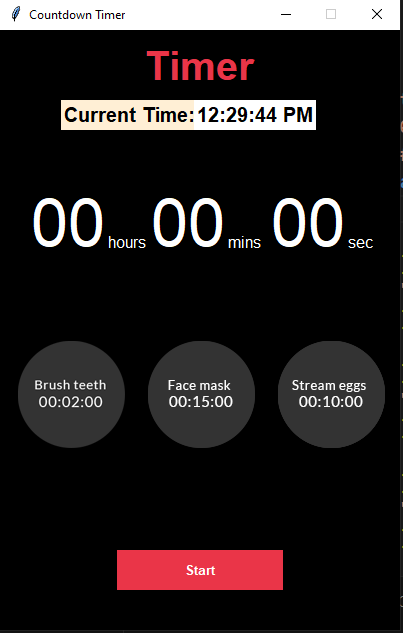

Here's the correct way to write your **Countdown Timer App** description in a proper `README.md` format, consistent with the earlier project:

---

# ⏳ Countdown Timer App using Tkinter

Welcome to the **Countdown Timer App**, a Python-based GUI application developed using **Tkinter** 🐍. This tool provides a simple, user-friendly interface to set timers manually or use quick-access preset timers for daily tasks like brushing, face care, and boiling eggs 🪥🥚🧼. It also includes a real-time digital clock display ⏰.

---

## 🔍 Overview

This app allows users to set a custom countdown timer by inputting hours, minutes, and seconds. Additionally, it offers one-click shortcut buttons to auto-set common durations. The sleek black-themed interface makes it visually appealing and easy to use.

---

## 🚀 Features

* 🕰️ **Live Clock Display**: Shows the current time in real-time.
* ⏳ **Countdown Timer**: Set your own timer by entering hours, minutes, and seconds.
* ⚡ **Quick Preset Buttons**:

  * 🪥 Brush Timer (2 minutes)
  * 🧼 Face Care Timer (15 minutes)
  * 🥚 Boiled Eggs Timer (10 minutes)
* 🖤 **Dark-Themed GUI**: Stylish and easy on the eyes.
* ✅ **Fully Responsive**: Updates the interface every second as the timer runs.

---

## 🧠 Learning Highlights

With this project, you will learn:

* GUI programming with Tkinter
* Real-time countdown handling using `time.sleep()` and `root.update()`
* Using preset button actions
* Time formatting and string handling
* Creating interactive and dynamic GUI layouts

---

## 🗃️ File Structure

```
📁 Countdown-Timer-App
├── main.py           # Main application file
├── brush.png                    # Icon for brushing preset
├── face.png                     # Icon for face care preset
├── eggs.png                     # Icon for eggs preset
├── README.md                    # Project documentation
├── (optional) /screenshots      # Folder for GUI screenshots
```

---

## ⚙️ Requirements

No external libraries required.

> Optional: Uncomment and use `playsound` for audio alert.

To install optional dependency:

```bash
pip install playsound
```

---
## 📸 Screenshots



## 💡 How to Use

1. Run the application using:

   ```bash
   python main.py
   ```
2. Enter your custom time or click on one of the preset buttons.
3. Press **Start** to begin the countdown.
4. Watch the timer and clock update live on the screen.

---

## 🚧 Future Enhancements

* Add a sound alert when timer ends 🔔
* Add pause/resume functionality ⏯️
* Add custom preset buttons
* Add animations or progress bars

---

## 📌 Conclusion

The Countdown Timer App is a practical and simple tool to manage daily timed tasks. Whether you're timing your morning routine or cooking an egg, this app is a great hands-on example of GUI development in Python.

---

Let me know if you want this combined with your other project in a single multi-project `README.md`!
